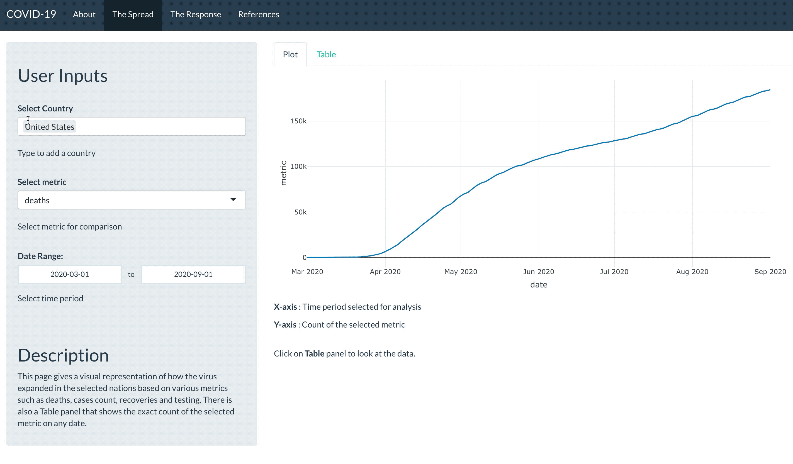

# Covid19Viz
<!-- badges: start -->
<!-- badges: end -->

The goal of _covid19viz_ is to run the COVID-19 exploration app designed with Shiny R package.

The app explores the spread of COVID-19 across various nations and also compares the measures taken by these country to combat the virus. This easy to use and lightweight app produces simple visualisations with an easy to use User Interface that is both minimal and functional.

### Features

**The Spread** - Explore cases, deaths, recovery and testing over a selected date range and countries.

**The Response** - Compare responses by the government for user-selectable parameters and date input.

## Installation

You can install the development version of covid19viz from [GITHUB]("https://github.com") with:

``` r
# install.packages("devtools")
devtools::install_github("etc5523-2020/r-package-assessment-aryan-monash")
```

## Example

To run the app use the R code mentioned below.

``` r
library(covid19viz)
## launch_app()
```
Below is a basic preview of the app in action.



Below is an example of the dataset

```r
> top_covid
#> A tibble: 50 x 35
#> Groups:   id [50]
#>   id    date         tests confirmed recovered deaths  hosp  vent   icu population school_closing
#>   <chr> <date>       <int>     <int>     <int>  <int> <int> <int> <int>      <int>          <int>
#> 1 USA   2020-10-01  1.19e8   7277791   2860650 207790    NA    NA    NA  326687501              3
#> 2 IND   2020-10-01  7.56e7   6392060   5348724  99221    NA    NA    NA 1352617328              2
#> 3 BRA   2020-10-01  NA       4847092   4299659 144680    NA    NA    NA  209469333             NA
#> 4 RUS   2020-10-01  4.68e7   1179634    960729  20796    NA    NA    NA  144478050              2
#> 5 PER   2020-10-01  3.91e6    818297    690528  32535  7511  1353  1353   31989256              3
#> 6 ESP   2020-10-01  1.01e7    778607    150376  31973    NA    NA    NA   46796540              0
#> 7 ARG   2020-10-01  1.80e6    765002    603140  20288    NA    NA    NA   44494502              3
#> 8 MEX   2020-10-01  1.73e6    748315    629630  78078    NA    NA    NA  126190788              3
#> 9 ZAF   2020-10-01  4.21e6    676084    609854  16866    NA    NA    NA   57779622              0
#> 10 FRA  2020-10-01  NA        577505     97271  32019  6652    NA  1265   66977107              1
#> … with 40 more rows, and 24 more variables: workplace_closing <int>, cancel_events <int>,

```


